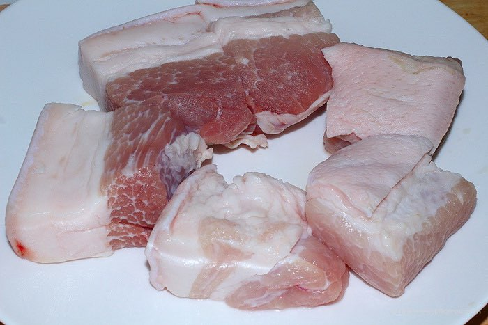
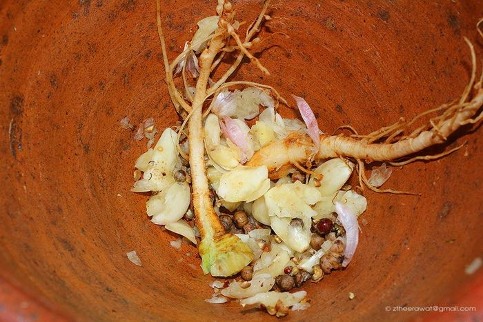
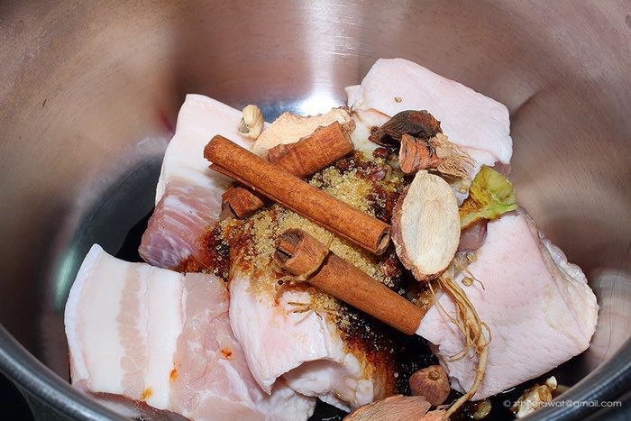
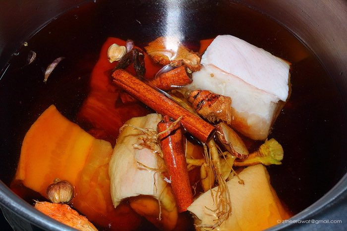
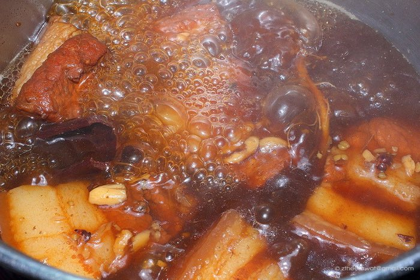

หมูฮ้องเป็นหนึ่งในอาหารท้องถิ่นภูเก็ตที่ต้องลองซักครั้งเมื่อมาภูเก็ต หมูฮ้องเป็นหมูสามชั้นที่เข้มข้นด้วยซีอิ้วและความมันเค็ม กลิ่นหอมๆจากกระเทียม พริกไทย และรากผักชี ทำให้อาหารจานนี้มีกลิ่นเอกลักษณ์เฉพาะ หมูฮ้องมีความคล้ายกับหมูพะโล้ แต่วัตถุดิบมีความเรียบง่ายมากกว่า

*อร่อยมาก*

# วัตถุดิบ
1. หมูสามชั้น 500 กรัม
2. กระเทียม
3. พริกไทยเม็ด
4. รากผักชี
5. ซีอิ๊วขาว 2 ช้อนโต๊ะ
6. ซีอิ๊วดำ 1 ช้อนโต๊ะ
7. น้ำตาลทรายแดง 1 ช้อนโต๊ะ
8. เครื่องเทศ ( โป๊ยกั๊ก ข่าแห้ง อบเชย กระวาน )
9. น้ำเปล่า

# Processes

## หั่นหมู

หั่นหมูสามชั้นออกเป็นชิ้นขนาดใหญ่หน่อย

*นี่คือหมู*

## รวมสมุนไพร

โขลกกระทียม พริกไทยเม็ด รากผักชี ให้พอแหลก

## ตั้งหม้อ

ตั้งหม้อ ใส่หมูสามชั้นและสามเกลอที่โขลกไว้ลงไป ตามด้วย ซีอิ๊วขาว ซีอิ๊วดำ และน้ำตาลทรายแดง

## ใส่เครื่องเทศ

ใส่เครื่องเทศลงไป ( โป๊ยกั๊ก ข่าแห้ง อบเชย กระวาน)

## เติมน้ำ

เติมน้ำจนท่วมเพื่อที่เราจะใช้ตุ๋น

## ตุ๋น

ตั้งไฟ ตุ๋นหมูสามชั้น โดยใช้เวลาประมาน 90 นาที อาจเติมน้ำเพิ่มถ้าน้ำแห้งเกินไป

## เสร็จละ

แค่นี้ก็ได้รับประทานอาหารท้องถิ่นส่งตรงจากภูเก็ตเลยทีเดียว