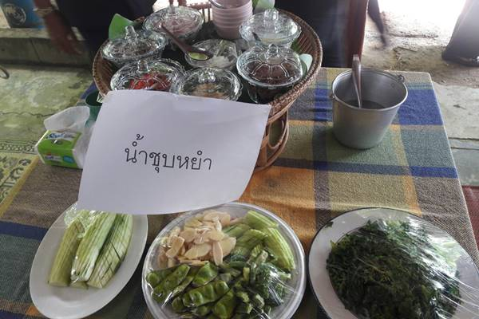

Nam Choob Yam of Chilli with shrimp paste is one of the Phuket local cuisine. It is similar to chilli paste from other part of Thailand, but this one adds more water with fresh, non-mashed ingredients, which are pieces of shallot, chilli, and small-sized shrimps. The process is also very easy to do. Phuket people usually mixed Nam Choob Yam with Kanom Jeen (Rice noodles) or eat with boiled vegetables.

## Ingredients

*The ingredients of Nam Choob Yam*

1. Fresh shrimp - 15 pieces
2. Fresh chilli - 20 units
3. Shallot - 15 units
4. Lime - 10 units
5. Fish source - 10 ml
6. Sugar - half teaspoons
7. Warm water - 0.5 cups

## ขั้นตอนการทำ

1. Crumple all the ingredients by hand in a bowl to mix them. Adjust the taste by gradually add lime juice and water to it to match the taste you like. Salt may be added if salty taste is less than what you expected.
2. When finished mixing them, put boiled small-sized shrimps on top of it and eat it with boiled vegetables or [Moo Hong](moo-hong).

3. enjoy :)